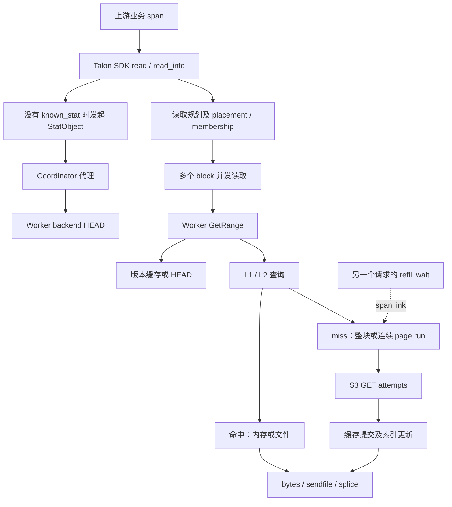
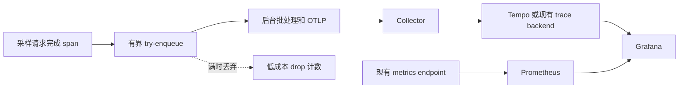

# Talon OpenTelemetry 设计：端到端读取追踪与性能约束

状态：实现已加入工作区；部署启用和性能验收仍待完成。参见 [实现与运行说明](../how-to/opentelemetry.md)。
初始实现与性能测量基线：`81e09496cc13cf270d1f919a56d109f6888b105f`。
编写日期：2026-09-09。
优先级：保持请求延迟和吞吐，其次扩大观测覆盖率。

本文记录设计契约；已落地 API、实际配置名及尚存的验收限制以实现与运行说明为准。已有代码行为在第 3 节和附录中给出来源。本文不代表性能数据、协议升级或实现已经通过验证。

## 1. 目标与设计结论

从一次上游业务请求的 trace，追踪到 Talon SDK、Coordinator、Worker，以及实际发生的 S3 数据回填和本地缓存 I/O，回答：

1. 一次逻辑 read 拆成多少个 block 请求，访问哪些 Worker，是否重试或切换副本？
2. 是否发生隐式 StatObject/HEAD？数据缓存命中是否仍伴随元数据回源？
3. 缺失多少 page，合并成多少个回填 run，实际执行多少次 GET attempt？
4. 当前请求发起多少次回填，又等待了多少次其他请求发起的共享回填？
5. 每次网络 I/O 花费多久，耗时集中在响应头等待、body 下载还是重试退避？
6. 本地缓存读取、写入、fsync、响应发送和 blocking 线程池排队各占多久？
7. 请求了多少字节、实际下载多少字节、提交缓存多少字节、返回多少字节？

采用以下架构：

- 用 `tracing` 表达 Rust 执行阶段，通过 OpenTelemetry layer 转换并导出。
- 用 W3C Trace Context 表达跨语言、跨进程上下文，用版本化 Talon 请求 envelope 传播。
- 用 parent/child 表达调用关系，用 span link 表达跨请求共享回填。
- 保留现有 Prometheus 指标与部署资产，新增指标独立定义，不从采样 trace 推算精确全量次数。
- 用有界后台 OTLP 导出，将详细记录限定在采样请求内。
- 首先验证热 L1/L2 路径性能，再扩大埋点与入口覆盖。

### 1.1 性能是上线门槛

运行时上下文传播、时间读取、span 创建、属性记录和入队都会有成本，异步导出不能消除这些成本。严格的数学意义零开销无法事先承诺。

产品要求是：默认开启后，不出现可重复测得的请求延迟或吞吐回归。实现不能自行把“允许 1% 或 5% 回归”当作已接受的要求。若测出稳定回归，则优化、收缩默认粒度或保持关闭，不以可观测性收益抵消性能损失。

编译关闭、运行时关闭、启用但未采样、标准采样、详细诊断分别验证。详细诊断的成本单独公布，不能用低采样率掩盖被采样请求本身的尾延迟。

### 1.2 范围

一期完整覆盖原生读取中的 GetRange、tenant range、cache-only range，以及必要的 StatObject 和 Coordinator 转发。后续覆盖 Gateway 自行回源及流式 body、多语言入口、预热和写入路径。

不包含修改缓存算法、读取并发策略、连接池语义、重试策略、对象版本语义和缓存持久化格式。trace context 不写入 WAL、block sidecar、对象元数据或 coordinator 的持久化业务状态。

不承诺从进程埋点直接得到 S3 服务端内部时间、SSD 物理请求时间，或在采样情况下恢复任意历史请求的所有 I/O 明细。

## 2. 性能工作模式

| 模式 | 执行行为 | 可见信息 |
| --- | --- | --- |
| 编译关闭 | 裁掉新增 recording/export 逻辑；协议解析按兼容需求独立编译 | 原有指标与日志 |
| 运行时关闭 | 在请求入口读取一次模式，使用原业务执行路径；主动发送继续使用 v1 | 原有指标与日志 |
| propagation-only | 有界解析和传递有效上下文，不建立 recording span、关联集合或新请求摘要 | 上下文穿透；本节点无详细 trace |
| standard，未采样 | 同 propagation-only；不重新在 page 层采样 | 原有指标及明确启用的新聚合指标 |
| standard，已采样 | RPC、整体缓存结果、回填 run、HTTP attempt、run 提交和发送阶段 | 端到端调用与每次回源尝试 |
| diagnostic，已采样 | 在 standard 上增加本地文件操作、fsync、排队等明细 | 每次被记录的应用层 I/O |

服务端即使 recording 关闭，也必须在启用了 v2 接收兼容的情况下正确跳过 metadata。此时接收 v2 的解析成本不为零，性能报告需单列，不能与纯 v1 关闭路径混为一谈。

新功能首次发布默认 `off`。完成协议兼容和性能验收后才按部署配置启用 standard。诊断模式必须有过期时间和数量预算，不接受任意外部请求直接强制全量记录。

### 2.1 热路径约束

以下约束适用于新增 telemetry 逻辑，不要求重写现有业务分配或同步：

- 未采样请求不得格式化对象 key、版本、地址或动态属性，不为 telemetry 建立 Vec/HashMap/HashSet。
- 不在每个 page、每次内存查找或每个 syscall 上建立 standard span。
- 不新增每请求 exporter task、线程切换、同步网络请求、探测 RTT 或 flush。
- 不引入所有 Worker/ring 共享的请求统计 map，不用全局原子累计单请求的所有子操作。
- 必需计数优先在局部累积，在现有完成点合并；不为统计改变 FuturesUnordered 的轮询、错误返回和 drain 行为。
- 保持响应 raw bytes、sendfile/splice、已有 I/O 缓冲区及其所有权。
- 只在选中记录的分支计算属性；仅把 span level 设为 debug 不能替代显式采样成本控制。
- 标准模式的 span 数主要随 RPC 数、实际回填 run 数、attempt 数增长，不能随热读取触及的 page 数线性膨胀。
- 背景导出资源同样计入性能预算，避免 CPU、内存带宽和缓存争抢被隐藏。

## 3. 当前代码架构与追踪缺口

### 3.1 原生读取链路



当前行为及代码位置：

| 位置 | 当前行为 | 设计影响 |
| --- | --- | --- |
| [Rust Client](../../clients/rust/src/client.rs) 的 read/read_into/read_into_resolved | 缺少 known_stat 时先 stat；跨 block 通过 FuturesUnordered 并发读取 | SDK span 必须覆盖元数据和所有 block 请求 |
| [BlockReader](../../crates/talon-cache-client/src/block_reader.rs) | placement/membership、副本尝试与刷新 | 每次网络尝试单独关联，不把重试折叠成一次 RPC |
| [WorkerClient](../../crates/talon-cache-client/src/worker_client.rs) | 连接复用失败后可能重新连接重试 | RPC attempt 包括 checkout、必要连接和完整响应消费 |
| [Coordinator](../../crates/talon-coordinator/src/main.rs) 的 proxy_to_worker/round_trip_worker | StatObject 代理到 Worker | 控制面必须传播上下文 |
| [WorkerRuntime](../../crates/talon-worker/src/runtime.rs) 的 serve/serve_range | 解析版本，412 后失效并重新解析、重试 | 区分版本恢复和 HTTP 瞬态重试 |
| WorkerRuntime 的 paged_block_range | 连续 leader page 合并为 run，run 有界并发，follower 等待共享加载 | page miss 数不等于 GET 数 |
| WorkerRuntime 的 fetch_and_commit / fetch_and_commit_pages | 后端取数完成后再提交本地缓存 | GET 成功不代表回填提交成功 |
| [InFlightLoads](../../crates/talon-worker/src/miss.rs) | 当前保存 LoadKey 到 Notify 的映射，guard drop 清理并唤醒 | 关联必须与实际 flight 生命周期一致 |
| [RetryingHttpClient](../../crates/talon-backend/src/retry.rs) | 对 HTTP 执行做 timeout、retry、backoff | 逻辑 fetch 与底层 attempt 分层 |
| [ReqwestClient](../../crates/talon-backend/src/reqwest_client.rs) | send 获取响应后再消费 body；也支持流式返回 | span 不能提前结束于响应头 |
| [PagedBlockStore](../../crates/talon-worker/src/paged_store.rs) | page 写入包含 write_all、sync_all、rename | 本地 I/O 成本必须与网络分开 |

### 3.2 协议与运行时

Talon 使用自定义 TCP framing。当前 [FrameHeader](../../crates/talon-transport/src/frame.rs) 是 16 字节 v1 header，包含 u32 request_id；[range request](../../crates/talon-transport/src/data.rs) 使用小型 bincode payload，成功响应携带原始数据。

request_id 只用于请求响应关联，不能作为跨进程 trace ID；它也不是永久唯一标识。trace ID 必须来自 OTel/W3C 上下文。

Worker 同时存在 [Tokio handler](../../crates/talon-worker/src/tokio_conn.rs)、[Monoio handler](../../crates/talon-worker/src/uring_conn.rs) 和 blocking pool。仅依赖线程局部的当前 span 无法自动跨越这些执行边界。

现有两套 handler 在等待下一帧之前开始 request_started 计时，长连接空闲可能被计入延迟。新 trace 将明确定义服务时间；修正原有 histogram 口径应作为独立、可审阅变更，避免悄悄改变监控含义。

### 3.3 现有观测设施

[talon-core::trace](../../crates/talon-core/src/trace.rs) 提供 RequestId、格式化日志初始化和辅助 span 宏，尚未形成 OTel 传播/导出闭环。可执行程序也各自初始化 fmt subscriber，必须统一处理。

[WorkerObservability](../../crates/talon-worker/src/observability.rs) 已有请求、缓存、后端 fetch、重试、timeout 等指标。[talon-observability](../../crates/talon-observability/src/lib.rs) 主要负责 Prometheus/Grafana 资产及验证。新 tracing 接入不要求替换这些指标。

### 3.4 其他读取入口

Gateway 自身可以向 origin 发请求，不能假设所有 S3 GET 都来自 Worker。必须覆盖 [Gateway S3](../../crates/talon-gateway/src/s3.rs)、认证/条件请求、cache-only 访问和原始/预签名流式转发路径。

C API 的 [talon_read_async](../../clients/c/src/lib.rs) 将任务交给 runtime.spawn，必须在提交线程复制 carrier。Python/Java 需要各自的语言上下文桥接。普通 FUSE 内核请求不会自动传递应用 OTel context；没有额外集成时只能建立 Talon/FUSE 局部 trace。

## 4. 统计与归因契约

### 4.1 三种不同层次

- 逻辑读取：一次 SDK read/read_into，可能含多个 RPC 和 Worker。
- 逻辑回填：一次整块加载或一个连续 page run 的 fetch + cache commit。
- HTTP attempt：一次底层 HTTP 执行，包含可能在收到响应之前失败的尝试。

不能用 page miss 数代替回填数，不能用回填数代替 HTTP attempt 数，也不能用采样后的 span 总数代替集群全量计数。

### 4.2 请求级字段

以下为拟议自定义属性，单位为 count 或 byte，均不是标准 OTel 属性：

| 字段 | 精确定义 |
| --- | --- |
| talon.read.id | 一个逻辑 read 的关联 ID；保持跨 block、RPC 重试不变 |
| talon.refill.id | 一个逻辑回填的唯一 ID；同一次回填的重试保持不变 |
| talon.refill.started | 当前执行实际启动的逻辑回填次数；排队但未启动不计 |
| talon.refill.completed | 成功完成预定缓存提交的回填次数 |
| talon.refill.failed | 已启动但失败的回填次数；与 cancelled 分开 |
| talon.refill.cancelled | 已启动但因取消未完成的回填次数 |
| talon.refill.shared_dependencies | 观察到的共享回填 ID 去重数，必须附带完整性状态 |
| talon.origin.get.attempts | 当前执行发起的 GET 执行尝试数，包含 retry |
| talon.origin.head.attempts | HEAD 执行尝试数，与数据回填分开 |
| talon.origin.body_bytes | HTTP 层实际消费到的响应 body 字节，包括失败时已消费的部分 |
| talon.origin.validated_bytes | backend 校验/裁剪后交付的有效数据字节 |
| talon.cache.committed_bytes | 已成功提交缓存的数据字节；不重复累计再读取 |
| talon.response.bytes | 实际成功写入响应的 payload 字节，不含协议 header |
| talon.details.complete | 本地应记录的明细是否完整；不能证明全链路完整 |
| talon.details.omitted | 因本地预算省略的明细数量 |
| talon.dependencies.complete | 共享依赖关联是否完整 |
| talon.propagation.gap | 某个已知 hop 无法传播的原因 |

取消后的 blocking 操作可能继续执行。若请求摘要已经结束，而后台 I/O 仍在完成，则摘要需标记未完成/取消，不能冻结一个“全部最终完成”的虚假数值。晚结束的子 span 可独立导出，不为了统计延长请求响应时间。

### 4.3 attempt 与 S3 收到请求的区别

attempt_started 发生在一次 HTTP 执行真正开始时；DNS/TCP/TLS 失败也属于 attempt。它不能证明服务端收到请求。收到响应时记录 HTTP status 和允许公开的 S3 request ID，支持与服务端日志核对。

Reqwest 自动 redirect/retry 如果仍存在，一次 execute 可能不等于一次网络请求。实施前必须审核锁定版本和配置，在实际 dispatch 层暴露多次发送，或在单独审阅、验证兼容性后统一由显式策略处理。不能为方便计数静默关闭原有 redirect/retry 行为。

body_bytes 表示应用收到的 body 字节，不包含 TLS/TCP 开销或网络重传；若客户端解压，应标注其计量位置，不称为精确网卡流量。失败尝试的部分 body 字节需要在消费流时累积，最终一次 bytes().len() 不足以覆盖。

### 4.4 示例

一个读取触及 4 个 page，中间一个 L2 命中，其余三个形成两个 miss run；第二个 run 第一次 GET 返回 503，重试成功：

| 量 | 值 |
| --- | --- |
| 缺失 page | 3 |
| 当前请求逻辑回填 started / completed | 2 / 2 |
| GET attempts | 3 |
| 成功提交 page | 3 |
| HEAD attempts | 根据 stat/版本缓存是否需要回源另计 |

S3 可能忽略 Range 返回 200，当前 backend 会校验并裁剪数据。因此 body_bytes 可能远大于 validated_bytes、committed_bytes 和 response.bytes。这个差异用于识别读取放大。

### 4.5 跨 Worker 汇总

Worker 只汇总本次 server request 所拥有的执行；父 span 不会自动累计远端后代属性。查询层以 talon.read.id 或明确的 span ancestry 选择一个逻辑 read 的所有 Worker 执行，再汇总。

同一 trace 可能含多个 Talon read，不能直接对整个 trace 求和作为某一次 read 的结果。统计 attempt 只数指定的叶级 attempt span，避免同时累加父子摘要。

共享依赖按 refill.id 做集合运算。多个等待 span、多个 page 依赖同一个 run，只算一次。发起者归因和依赖者归因分别展示，不将共享流量重复计入全局 origin bytes。

查询结果必须标注 known_complete / partial / unknown。进程崩溃、导出丢弃、未采样 leader、旧协议 hop 或 late span 都可能导致不完整；“没有看到 GET span”不能自动显示成“没有 GET”。本地 complete 标记也无法证明 exporter 之后没有丢失。

## 5. 模块与依赖

新增 `crates/talon-telemetry`，集中定义轻量 carrier、上下文选择、span/统计 helper、provider 生命周期和导出配置。依赖图保持无环：

```text
talon-telemetry（不依赖 worker/backend/transport/core 业务类型）
  context / recording helpers / 可选 SDK-export feature

talon-transport -> 轻量 carrier 或独立的 transport metadata 类型
client / coordinator / worker / backend -> recording helpers
binary 或宿主显式初始化入口 -> SDK / exporter
talon-observability -> Collector/Grafana/Prometheus 部署资产及验证
```

crate 的边界是可共享的 telemetry 行为，不把对象存储、缓存或重试策略搬入其中。现有 core RequestId 保留业务用途，不能让 core 强制加载 exporter。

候选依赖为 tracing、tracing-subscriber、tracing-opentelemetry、opentelemetry、opentelemetry_sdk、opentelemetry-otlp。实现时锁定一套相互兼容的版本与 features；当前 workspace 声明 Rust 1.80，必须验证直接及传递依赖的 MSRV，不能默认最新版本可用，也不能随本变更隐式提高 MSRV。

### 5.1 上下文与 recording 分离

请求内部可使用以下概念模型，非可直接编译的 API：

```text
RequestTelemetry
  mode: Off | Propagate | Standard | Diagnostic
  carrier: 可选、已校验的 W3C context
  read_id: 可选
  recording: 仅已采样请求存在的 span/budget/summary
```

carrier 存在不代表要建立 recording span。未采样传播可使用轻量非 recording context，甚至保留有效 parent 直接透传；无需为每个未采样 child 生成新的 recording 对象。

摘要通过已有子任务返回值合并，优先避免 Arc<AtomicStats> 在所有子操作间共享。确需异步跨线程完成的状态只在 sampled path 建立，并用基准证明同步成本。

### 5.2 初始化与宿主共存

Worker/Coordinator/Gateway 二进制在启动时显式建立 provider、subscriber 与 shutdown owner。库函数不能隐式设置全局 provider/subscriber。

Rust 宿主可安装 Talon 所需 layer；显式传入的 context 优先于当前 tracing span。C/C++ 场景通过 carrier 桥接，不共享 OTel SDK 内部指针。独立 Rust subscriber 可绑定到 Talon futures 的 dispatcher，不能覆盖 C++ 或其他 Rust 组件的全局配置。

一个进程共享导出设施，不能每个 client 创建 exporter。日志 EnvFilter 仅作用于日志层；recording span 的启用不能被 RUST_LOG=warn 意外截断。

## 6. 上下文传播与 SDK 接口

### 6.1 传播标准

外部边界采用 traceparent/tracestate。保留有效 trace ID、parent span ID、trace flags 和合规 tracestate；无效上下文不会导致合法业务读失败。使用标准 parser，支持规范允许的版本演进，不能把当前常见的 55 字符 traceparent 长度误当成所有未来版本的唯一合法长度。[W3C Trace Context](https://www.w3.org/TR/trace-context/)

每个已记录的 outbound RPC 创建 CLIENT span，并注入它的 context。接收端从 carrier 提取 remote parent，建立 SERVER span。Coordinator 转发、Worker 间调用、SDK reconnect/retry 都遵循同一规则。

上下文属于请求，不能属于 ConnectionPool 的共享连接状态。连接归还池后不得残留 last_trace 字段。HTTP origin span 默认在本地记录，不依赖 S3 支持 OTel；无需向云存储附加 trace headers。对内部可观测 S3 兼容服务传播时，需明确允许并兼容签名流程。

### 6.2 SDK 兼容接口

SDK 必须修改实现并增加显式的请求级接口。旧 API 保留不代表 SDK 无需改动，也不代表只升级 Worker 就能继承上游 trace。下面冻结提案的接口形态和语义；代码示例都是拟议 API，尚不能用当前 SDK 编译运行。

#### 6.2.1 哪些调用方需要改代码

| 调用方式 | SDK 需要的变化 | 业务调用方是否必须改读接口 |
| --- | --- | --- |
| Rust，已安装兼容的 tracing-OTel layer，future 在上游 span 内 poll | 旧 read/read_into 内增加 context 捕获及向下传播 | 可以继续调用旧方法；仍需升级 SDK 和正确初始化 layer |
| Rust，宿主只有原生 OTel Context，或 future 跨 task/dispatcher | 新增显式 RequestOptions/TraceContext | 使用显式 options，或在调度边界正确 instrument future |
| C/C++，希望关联上游业务 trace | 新增携带 carrier 的 C 函数及结构体 | 必须由调用方/适配层传入每个请求的 parent；旧 C 调用不会自动读取 C++ OTel context |
| Python/Java，安装语言侧桥接 | 包装层在提交前捕获该语言当前 context | 普通调用可保持不变；桥接实现必须修改，显式覆盖也应可用 |
| 无上游 context 的旧调用 | SDK 可按本地配置建立局部 trace | 不强制改调用；但不能声称已关联上游 |

进程级 telemetry 初始化只决定是否记录、如何导出，不提供某次请求的 parent。给 client 构造函数配置一个 trace_id 会让并发请求串线，因此 parent 只能放在请求 options 或正确的执行 scope 中。

#### 6.2.2 Rust 公共接口

当前 [Client](../../clients/rust/src/client.rs) 的 read/read_into/stat 签名没有 context 参数。保留这些方法，并新增：

```rust
// 设计签名；类型由 talon_rust_client 重新导出。
pub struct TraceContext { /* opaque，拥有已校验的 carrier 数据 */ }

impl TraceContext {
    // 无效/缺失 traceparent 返回 None；无效 tracestate 不使合法读失败。
    pub fn from_w3c(traceparent: &str, tracestate: Option<&str>) -> Option<Self>;
}

pub enum TraceParent<'a> {
    Inherit,                    // 从本次执行所在的 tracing scope 继承
    Explicit(&'a TraceContext),  // 使用指定 parent，禁止再读取 ambient parent
    Root,                       // 不使用任何 parent；是否记录新 root 由配置决定
}

pub struct RequestOptions<'a> {
    pub parent: TraceParent<'a>,
}

// RequestOptions::default() 的 parent 为 Inherit。
impl Client {
    pub async fn read_with_options(
        &self,
        object: &ObjectId,
        offset: u64,
        length: Option<u64>,
        known_stat: Option<&ObjectStat>,
        options: &RequestOptions<'_>,
    ) -> Result<Vec<u8>, Error>;

    pub async fn read_into_with_options(
        &self,
        object: &ObjectId,
        offset: u64,
        dst: &mut [u8],
        known_stat: Option<&ObjectStat>,
        options: &RequestOptions<'_>,
    ) -> Result<usize, Error>;

    pub async fn stat_with_options(
        &self,
        object: &ObjectId,
        options: &RequestOptions<'_>,
    ) -> Result<ObjectStat, Error>;
}
```

采用 Talon 自有 opaque carrier，基础 SDK 的 public API 不直接绑定某个 opentelemetry::Context crate 版本。可选 OTel adapter feature 提供 Context 到 TraceContext 的转换，只提取追踪所需 SpanContext/tracestate，不复制 baggage 或宿主请求数据。

旧方法委托默认 options，业务返回值、known_stat、EOF、版本行为和错误类型不变。read 内部调用 stat 和 read_into_resolved 时传递同一个已经建立的 RequestTelemetry，不重新执行公共入口的 Inherit，也不重复创建 talon.read 根 span。

继承优先级为：进程 mode=off 直接走关闭路径；否则 Explicit > Inherit 中有效当前 tracing-OTel context > 本地 root 策略。Root 明确禁止 ambient 继承。显式 carrier 无效时适配层选择 Root，而不是回退到一个可能属于其他请求的 ambient span。

Rust async fn 在首次 poll 才执行函数体，因此旧方法的 Inherit 捕获发生在首次 poll，而不是调用返回 future 的那一刻。以下代码不能假定继承创建 future 时的 span：

```rust
let future = client.read(&object, 0, Some(4096), None);
// 随后在另一个任务/dispatcher 中 poll future：没有自动保留原 parent 的保证。
```

显式传入的示例：

```rust
// 应在跨 task 前，从上游 scope 获取 carrier。
let parent = TraceContext::from_w3c(upstream_traceparent, upstream_tracestate);
let options = RequestOptions {
    parent: match parent.as_ref() {
        Some(cx) => TraceParent::Explicit(cx),
        None => TraceParent::Root,
    },
};
let n = client
    .read_into_with_options(&object, offset, &mut dst, known_stat.as_ref(), &options)
    .await?;
```

RequestOptions 借用的 TraceContext 在 future 完成/drop 前有效，由 Rust 生命周期保证。spawn 'static 任务时把拥有的 TraceContext move 进任务，在任务内构造借用 options；不要把借用的线程栈 options 交给后台执行器。完整 SDK 初始化另行执行，不发生在每次 read_with_options 中。

#### 6.2.3 C ABI 与 C++ 桥接

当前 [talon.h](../../clients/c/include/talon.h) 的 talon_read_async 没有 context 参数，talon_client_options 也没有 struct_size，不能直接向旧结构体追加字段并让新库读取旧调用方未分配的内存。保留所有旧函数和旧结构体布局，新增独立的请求 options：

```c
/* 设计声明；原有 talon_client / talon_callback 等类型保持不变。 */
#define TALON_REQUEST_OPTIONS_VERSION_1 1u
#define TALON_TRACE_PARENT_NONE 0u
#define TALON_TRACE_PARENT_EXPLICIT 1u

typedef struct talon_request_options {
    uint32_t struct_size;
    uint32_t version;
    uint32_t flags;          /* v1 必须为 0，预留扩展 */
    uint32_t parent_mode;    /* NONE 或 EXPLICIT，无自动 C++ TLS 继承 */
    const char *traceparent;
    size_t traceparent_len;
    const char *tracestate;
    size_t tracestate_len;
} talon_request_options;

/* size 来自调用方 sizeof，初始化器不能越界写入未来/旧版本结构体。 */
int talon_request_options_init(talon_request_options *options, size_t size);

int talon_read_async_with_options(
    talon_client *client,
    const char *uri,
    uint64_t offset,
    uint8_t *dst,
    size_t dst_len,
    const char *version,
    const uint64_t *object_size,
    const talon_request_options *options,
    talon_callback callback,
    void *user_data,
    uint64_t *request_id_out);

int talon_stat_async_with_options(
    talon_client *client,
    const char *uri,
    const talon_request_options *options,
    talon_callback callback,
    void *user_data,
    uint64_t *request_id_out);
```

options=NULL 与 parent_mode=NONE 均表示没有外部 parent。若 SDK 配置允许，可以建立局部 root；二者都不能从 Rust runtime 的环境中猜测 C++ 的当前请求。旧 talon_read_async/talon_stat_async 使用这一无外部 parent 的路径，不能意外采用 Rust 默认 Inherit。

C++ 调用流程是“从上游 OTel Context 注入 W3C carrier → 填写 options → 提交异步读取”。具体 OTel 注入函数由宿主 adapter 按其版本实现；下面示例中 tp/ts 是该步骤得到的普通字符串：

```cpp
// 设计用例，新增符号尚未实现。
talon_request_options options;
int rc = talon_request_options_init(&options, sizeof(options));
if (rc != TALON_STATUS_OK) {
    return rc;
}
options.parent_mode = TALON_TRACE_PARENT_EXPLICIT;
options.traceparent = tp.data();
options.traceparent_len = tp.size();
options.tracestate = ts.empty() ? nullptr : ts.data();
options.tracestate_len = ts.size();

rc = talon_read_async_with_options(
    client, uri, offset, dst, dst_len,
    known_version, known_size, &options,
    callback, user_data, &request_id);
// 返回后 options、tp、ts 可以销毁；dst 的独占生命周期仍持续到 callback。
```

传入的是上游 parent 的完整 carrier，不能只传 trace_id：SDK 需要 parent span ID、trace flags 和可选 tracestate 才能建立正确关系。已有 request_id_out 继续用于 C 异步结果关联，不能重命名或解释成 trace ID。

#### 6.2.4 C options 校验、所有权与兼容

- initializer 校验 size 至少覆盖当前 v1 结构体且可表示为 struct_size，只初始化其知道且调用方已分配的范围，设置 version=1、flags=0、parent_mode=NONE 和空 carrier。
- 提交函数先校验固定 header 的最小 struct_size，再按版本读取已定义字段。v1 接受更大的 struct_size 并忽略尾部；过短、未知版本、未知 parent_mode、非零保留 flags 返回 TALON_STATUS_INVALID_ARGUMENT，不调度 callback。
- len=0 时允许 pointer=NULL；len>0 时 pointer 必须非 NULL，且调用方保证指定范围在函数调用期间可读。违反这一 C 内存安全契约不是可恢复的 trace parser 错误。
- 合法 ABI 中 carrier 的无效格式或超预算属于 telemetry 错误：丢弃无效 context、按无 parent 处理，合法 read 仍提交。禁止回退继承某个不相关的 ambient parent。tracestate 可单独按标准丢弃。
- 在 talon_read_async_with_options 返回前完成有界校验与必要复制。Rust 后台任务只能持有自己的载体，不能借用 options、traceparent 或 tracestate 指针。
- 关闭 telemetry 时仍校验 options 的 ABI 结构，但无需解析/复制不使用的 carrier。NONE/NULL 路径不新增 telemetry 分配。
- dst、client、callback executor、user_data、request_id_out 的原有契约不变：client 要活到回调结束，dst 由 SDK 独占到 callback。carrier 可以更早销毁，不代表 dst 可以更早复用。
- 新应用链接旧动态库会缺少新增符号，因此发布时声明最低 SDK 库版本；静态链接一并升级。只有显式支持旧库的宿主适配器才做一次性的符号能力选择，不能在每次 read 上探测。

编译 C header、导出符号、Rust extern 实现、package/build 产物和 C smoke example 必须在同一 SDK PR 中更新。只修改 Rust 库内部函数不算完成 C API 接入。

#### 6.2.5 SDK 内部必须贯通的调用路径

仅在公共入口增加 options 还不够。入口解析后形成不可变的 RequestTelemetry，继续贯穿：

```text
C/C++ carrier 或 Rust options/current span
  -> SDK operation scope（仅一次 parent 选择，生成一次 read.id）
     -> 必要的 StatObject -> CoordinatorClient -> v2 Control request
     -> read_into_resolved
        -> 每个 BlockReader 子请求
           -> membership/placement 请求（如实际发生）
           -> WorkerClient 的每个 RPC attempt
              -> pool checkout/connect
              -> 从本 attempt 的 CLIENT span 注入 v2 metadata
              -> 完整响应消费
```

内部方法新增接受请求上下文的 helper，已有公开方法保留默认 wrapper；避免改动所有外部依赖现有 talon-cache-client API 的调用方。至少覆盖 CoordinatorClient::stat_object、BlockReader::read_block_into、WorkerClient::fetch_range/fetch_range_into 及相关重试路径。

read.id 和逻辑 read parent 在跨 block 时保持一致；每个实际 outbound attempt 有独立 CLIENT span ID。当前 SDK 的重试可能复用已经编码好的 request buffer，实施时要检查这一点：下一次 attempt 的 carrier 必须在新 span 建立后重新注入，不能把第一次 attempt 的 span ID 反复发送。

不把 trace context 存进 ObjectId、ObjectStat、BlockId、placement cache 或连接池。known_stat 只用于对象身份/大小，不能携带请求上下文，因为它会被多次读取和多个 trace 复用。

#### 6.2.6 自动继承需要什么初始化

Rust 旧 read 方法能够继承的条件是：当前 dispatcher 上存在兼容的 tracing-OTel layer，且 future 在正确的上游 span scope 中 poll。只有 tracing 日志 subscriber、只有原生 OTel provider，或把 future 交给没有继承 dispatcher 的 task，都不满足这一条件。

C/C++ 即便已初始化宿主 OTel SDK，也不会自动把它的 Context 映射到 Rust thread-local 状态；必须走上面的 carrier 桥接。Talon 的进程级 provider/exporter 初始化由宿主显式完成，不能把“调用方传了 parent”当作自动安装全局 SDK 的授权。

初始化允许 propagation-only：即使不导出 Talon SDK 本地 span，也可把合法 parent 传给 Worker。要同时看到 SDK 本地 span，则必须配置 SDK recording/export。若对端只能 v1，显式传参也不能实现跨进程传播，必须显示 propagation gap。

#### 6.2.7 Python、Java 与其他入口

Python 包装层提供可选的显式 trace_context 参数及语言侧自动继承桥接；auto 模式先在 Python context 有效时提取 carrier，再进入 py.allow_threads/runtime.block_on。当前 [Python read](../../clients/python/src/lib.rs) 在只提供部分 version/size 时会先自行 stat：这个分支也必须处于同一入口 operation scope/read.id 中，不得只给后续 Rust read 传 context 而遗漏前面的 HEAD；保持现有元数据补全语义。

Java 保留现有 read 重载，并增加接受 request options/carrier 的重载；自动桥接在调用入口捕获 Java Context，后续 executor 任务使用捕获结果。HTTP Java agent 不会自动给 Talon 自定义 TCP framing 注入 context，因此必须修改 Java 的协议编码实现。

Gateway 在 HTTP 入口提取后通过内部 RequestTelemetry 传播。FUSE 没有应用桥接时只产生局部 trace，不承诺改一个 Worker 开关就能继承应用请求。

#### 6.2.8 SDK 专项验收

| 测试 | 预期 |
| --- | --- |
| 旧 Rust API，在兼容 layer 的上游 span 内 poll | SDK read 是上游的 child，下游保持 trace ID |
| Rust explicit A，但 ambient span 为 B | 只关联 A，不关联 B |
| Rust Root，ambient span 为 B | 不关联 B；是否创建 root 由配置决定 |
| Rust future 在创建后转移 task | Inherit 的首次 poll 语义清楚；explicit/instrument 路径仍正确 |
| 同一 C client 同时提交两个 parent | 两个 trace 不串线，不共享 last_trace |
| C 提交后立即销毁 options 和 carrier | 异步请求仍正确，不出现 use-after-free |
| 旧 C 符号、NULL options、NONE mode | 保持旧 ABI/业务结果，不自动继承 C++/Rust ambient context |
| C 合法 ABI 但无效 traceparent | 合法业务仍执行，不回退到错误 ambient parent |
| C 未知 options 版本或过短 struct_size | 同步参数错误，不读取越界字段，不调度 callback |
| C/Rust 缺少 known_stat | stat 和所有 block 子请求在同一 read scope/read.id 内 |
| Python 部分 version/size | 入口自行 stat 也被关联，不改变补全语义 |
| reconnect/retry 重用 request buffer | 每次注入新的 CLIENT span ID，read.id 不变 |
| telemetry off / 无 parent | 不新增 carrier 拷贝、格式化或请求级 telemetry 分配 |
| 显式传 parent，但对端 v1 或 exporter 未启用 | 分别报告传播缺口或仅传播能力，不宣称全链路已导出 |

异步 callback 不自动继承提交线程 context。宿主若需要在 callback 中恢复 C++/Python/Java scope，应由自己的 adapter 显式管理，并在 callback 返回时退出。读取 span 在 I/O 结果形成时结束，callback 排队/执行如需追踪另建阶段，避免用户 callback 时间污染 I/O 时间。

### 6.3 异步执行规则

- async 函数和 block 用 `.instrument(span)` 或等价的 per-poll scope。
- tokio::spawn、monoio::spawn、跨线程提交显式携带 context；不假定自动继承。
- FuturesUnordered 中每个并发子 future 绑定正确的父 span，保持原并发行为。
- blocking closure 捕获轻量 span/context，在同步 closure 内进入并退出。
- 禁止持有 Span::enter 或 OTel attach guard 跨越 await；否则其他任务可能被关联到错误 span。[tracing 异步 scope](https://docs.rs/tracing/latest/tracing/struct.Span.html)
- 不通过延长 Span 的强引用，间接延长请求 buffer、文件或 singleflight guard 生命周期。

## 7. Talon wire protocol v2

### 7.1 为什么需要版本化

不能直接向 v1 bincode RangeRequest 尾部追加 Option<context> 并假定兼容。现有 header 没有完整 trace carrier，request_id 也不能承载它。选择独立 v2 envelope，v1 编解码保持原样。

### 7.2 拟议编码

header 仍为 16 字节，沿用 magic、msg_type、flags、request_id、length 的位置；version=2。FrameHeader 内部需要保存解析到的版本，encode 不能继续无条件写固定常量。

```text
v2 request frame:
  header[16]
  metadata_length: u16 big-endian
  metadata[metadata_length]: TLV entries
  original_business_payload

TLV entry:
  key: u8
  value_length: u16 big-endian
  value[value_length]

key 1: traceparent，W3C text
key 2: tracestate，W3C text
key 3: logical_read_id，16-byte opaque ID，仅需要关联时携带
key 4: detail_level，1 byte，standard/diagnostic 提示；接收端策略优先
```

metadata 的拟议硬上限为 1024 bytes，不含 metadata_length 的 2 bytes。tracestate 遵循标准限制；未知 TLV 在长度合法时跳过；重复已知字段、非法长度按下面的错误策略处理。该上限和 key 分配在 wire conformance PR 中冻结，当前不是已发布契约。

metadata_length=0 表示无上下文。v2 request header.length 包含 2 + metadata_length + 原业务 payload 长度。控制消息 payload 仍使用现有 codec；租户信息继续由原有业务请求表达，trace metadata 不覆盖认证/tenant 数据。

成功响应保持原业务响应形态：GetRange 是原始字节，Control 是原有控制响应；不加响应 metadata 前缀。响应 header 使用对应请求的协议版本。这样不改变 sendfile/splice 的 payload，也不要求 SDK 在成功读响应后另收一个 trailer。

一期只为批准支持的 read/control message 开启 v2。Put、AdmitCachedBlock 等已有独立 payload/body 语义的操作继续 v1，直到定义并验证 envelope 与流式 body 的长度关系；不能套用“整个 body 都是小 request payload”的假设。telemetry 提案不改变这些业务操作语义。

### 7.3 限制与错误处理

在 header 到达时先校验按 msg_type 的总上限：原业务上限加固定 metadata 预算。读取 2-byte metadata_length 后先校验 1024 上限，再解析 metadata；原业务 payload 仍按旧上限独立校验。使用 checked arithmetic，不能因 telemetry 放宽请求分配上限。

- envelope 截断、越界或 framing 错误：按协议错误关闭或返回明确错误，不尝试猜测边界。
- envelope 合法但 traceparent 无效：丢弃上下文，继续业务。
- 无效/重复 trace 字段：丢弃不可信 context，低基数记录解析异常；不把它当作授权失败。
- 发送端 carrier 超出预算：丢弃可选 metadata，必要时仅传播可合法保留的核心 context，并记录 propagation gap；不能截断成貌似合法的随机字符串。
- diagnostic hint 是请求提示，不能突破服务端配额和权限。

codec、Tokio reader、Monoio BufferedFrameReader、错误响应、控制面 TLS 路径和语言实现必须共用同一协议契约。编码利用原请求缓冲区或 scatter/gather，避免新增 syscall；不增加业务 RTT。

### 7.4 滚动升级与回滚

| Client | Server | 行为 |
| --- | --- | --- |
| v1 | v1 | 原行为 |
| v1 | v1/v2 | 原行为；必要时服务器建立局部 trace |
| v2-capable，目标能力未知 | v1 或未知 | 主动发送 v1；标记不能贯通该 hop |
| v2-capable，确认目标支持 v2 | v1/v2 | 发送 v2 并传播上下文 |

先部署双版本服务端，再部署客户端，最后按明确的目标能力配置启用。第一版可使用 endpoint/部署级能力配置，不必修改持久化 membership schema；后续如通过 discovery 发布能力，应单独审阅兼容性。

能力选择不增加每请求探测。禁止把连接断开或请求超时当作“对端不支持 v2”的可靠信号并自动重发 v1，因为第一次请求可能已执行。

关闭 recording 不等于删除 v2 接收支持。回滚顺序为先关闭主动 v2 发送、排空相应请求/连接，再回滚服务端；存在旧服务端时不能让持有过期能力缓存的客户端继续发送 v2。

## 8. Span 模型与埋点位置

### 8.1 标准模式

| Span | Kind | 边界 | 主要属性 |
| --- | --- | --- | --- |
| talon.read | INTERNAL | SDK 调用开始到返回完整结果 | read.id、范围、outcome、planned_blocks |
| talon.rpc | CLIENT | 每次 checkout/连接尝试到消费完整响应或失败 | operation、peer、attempt、pool.reused |
| talon.rpc | SERVER | 完整合法请求已解析到响应发送完成或失败 | operation、runtime、outcome、response.bytes |
| talon.version.resolve | INTERNAL | 版本缓存检查及必要 HEAD | cached、reason |
| talon.refill | INTERNAL | run/whole 实际启动到缓存提交结束 | refill.id、form、pages、range、终态 |
| talon.refill.wait | INTERNAL | follower 实际等待区间 | links、依赖完整性、wait outcome |
| talon.origin.fetch | INTERNAL | 一次逻辑 backend range 调用，包括 retry/backoff | backend、range、attempts、validated_bytes |
| HTTP attempt | CLIENT | 一次 HTTP 执行开始到 body 完成/失败/取消 | method、status、resend_count、body_bytes |
| talon.cache.commit | INTERNAL | 整个 run/whole 的本地提交 | pages、committed_bytes、duration |
| talon.response.send | INTERNAL | 发送 header/payload 到完成或失败 | mode=bytes/sendfile/splice、bytes |

热 L1/L2 默认只在 request span 上记录汇总结果，包括 hit tier、涉及 page 数和传输模式。只读命中不建立 page lookup span。一个请求混合 L1/L2/origin 时用 mixed 和各类计数表达，不能简单归类为 hit 或 miss。

HTTP 属性优先使用标准 method、status、server.address、server.port、http.request.resend_count、error.type；Talon 专有属性放在 talon.*。锁定语义约定版本并验证自动 instrumentation 不会与手动 attempt 重复计数。[HTTP span 约定](https://opentelemetry.io/docs/specs/semconv/http/http-spans/)

RPC connection idle 等待不进入新 SERVER span。接收 frame 的时间需要 transport 记录真实开始接收时间才能细分；未实现时标明 SERVER duration 仅为完整解析后的服务时间。客户端到服务器两侧时间之差也不能直接当成纯网络时间。

### 8.2 详细模式

详细模式增加下列本地阶段，可按请求预算单独记录：

- cache file read/open；区分 FD cache 命中和实际文件操作。
- blocking queue：提交到 closure 开始执行。
- write、fsync、rename、sidecar write。
- sendfile/splice helper 的排队与执行；必要时记录多个 segment 的操作明细。
- 真实可观测的调度等待；不制造一个与现有业务无关的“telemetry queue span”。

应用层 write/read/sendfile duration 不等于 SSD 服务时间。一个 syscall 可能含页缓存处理、磁盘等待和 socket 背压。设备级观测可关联系统指标或后续 eBPF，不能在本方案中伪造分解。

### 8.3 错误、取消与生命周期

每个已创建的 operation/span 在 success、error、timeout、cancel、early-drop 路径都结束。已处理的 HTTP attempt 错误不要求把最终成功的 read 标为 ERROR，但 retry count 仍保留。

cache-only miss 属于该操作的预期结果类型，记录 outcome=cache_miss；是否属于调用失败由上层语义决定。限流、不就绪、版本不匹配与 origin error 使用稳定的分类，不用错误字符串作为 label。

当 timeout 在 RetryingHttpClient 外层触发时，inner future 可能直接 drop。需要轻量 attempt completion guard 或等价的终态机制记录 timeout，不能只依赖 execute 正常返回后设置状态。guard 的职责是记录，不持有或释放业务 guard。

### 8.4 源码改动地图

| 文件/模块 | 插入点 |
| --- | --- |
| clients/rust/src/client.rs | read 根 span、stat、并发 block 关联 |
| clients/c/src/lib.rs | options/carrier 拷贝、spawn 的 dispatcher/context |
| talon-cache-client/worker_client.rs、pool.rs | 每次 RPC attempt、checkout/connect、响应完整消费 |
| talon-cache-client/coordinator_client.rs、block_reader.rs | 控制面传播、placement、retry/replica 关系 |
| talon-coordinator/main.rs | SERVER span、proxy outbound CLIENT span |
| talon-transport/frame.rs、codec.rs、data.rs、uring.rs | v1/v2 编解码及有界 carrier |
| talon-worker/tokio_conn.rs、uring_conn.rs | 请求 scope、早期拒绝、send 和错误终态 |
| talon-worker/runtime.rs | 版本解析、run/whole 回填、等待、提交摘要 |
| talon-worker/miss.rs | 可选 flight 关联，保持业务 guard 生命周期 |
| talon-worker/block_store.rs、paged_store.rs | blocking 排队和本地 I/O 明细 |
| talon-backend/retry.rs | retry/backoff/timeout 原因和 attempt 关联 |
| talon-backend/reqwest_client.rs | HTTP attempt、响应头、body、流式 drop |
| talon-backend/s3.rs | 逻辑操作语义、范围校验、S3 request ID |
| talon-gateway | HTTP parent 提取、origin forwarding、body 生命周期 |
| talon-worker/main.rs 及其他 binary | provider、layer、配置、shutdown |

## 9. 共享回填与 singleflight

### 9.1 归因模型

```text
read A
  worker A
    refill R
      HTTP GET attempt
      cache commit

read B
  worker B
    refill.wait -- span link --> refill R
```

R 归属于实际发起者 A。B 不创建假的 GET span，也不把 R 改成自己的 child。A 发起 1 次、B 发起 0 次、B 依赖 1 次，全局物理执行只计 1 次。span link 是跨 trace 的关系，查询后端未必自动展开或保留目标 trace。[OTel Link API](https://opentelemetry.io/docs/specs/otel/trace/api/)

### 9.2 可选关联 entry

现有 Notify entry 在 recording 需要时携带一个可选 TraceFlightRef：

```text
existing flight entry
  notify
  optional trace_ref

TraceFlightRef（只在需要记录的 flight 分配）
  flight generation / id
  leader request SpanContext
  可晚绑定的 refill id / SpanContext
  terminal outcome
```

只保存 SpanContext/ID，不保存活跃 Span 强引用、请求 buffer 或业务 guard。Follower 在 admission 判断已有 flight 时，原子地获取对应 entry 的稳定引用，不能在 wait 完成后重新从 map 查询并关联到另一次加载。

page admission 先于 run 合并。run 确定后，把同一 refill ID/context 发布到 run 覆盖的 page trace_ref；follower 可在结束前读取并补 link。没有 context 就记录缺失，不新增等待 publication 的 await。一个 run 的多个 page 只生成一个 unique dependency。

这会涉及已有同步区内的可选字段读写，必须单独测高竞争 same-page miss。未采样 flight 不额外分配 trace_ref，不为了完整性建立全局 load registry。

### 9.3 采样不一致

采样 B 可能等待未采样 A：A 没有记录的 refill span 和 trace_ref。此时 B 可以记录自己确实等待过以及等待时间，但不能给出完整的 unique shared-refill 数，更不能补造 A 的网络明细。设置 dependencies.complete=false，依赖数量显示为已知下界或 unknown。

需要完整共享依赖时，在受控诊断范围内让相关请求统一全量记录。晚到的 B 不能追溯开启 A 的历史记录。即使两者都采样，独立 tail sampling 或保留期限也可能使 link 目标不可用。

### 9.4 失败与重新加载

leader 失败、取消或被 drop 后，业务 guard 按原逻辑释放。Follower 之后自行回源时建立新 refill ID，并以自己的请求为 parent；与先前等待的失败 flight 保留 link。

map entry 被移除并重建时不能复用旧 ID。现有 wait 可能跨越重新 admission，观测需标记跨 generation/未知关系，或记录实际捕获到的多个依赖；不为了追踪修订原来的重试和唤醒规则。

run 出错后的既有 drain 行为和 blocking 写入生命周期保持不变。禁止因提前结束 telemetry span 而提前释放业务 InFlightGuard。

## 10. I/O 时间与字节测量

### 10.1 S3 与 HTTP

```text
origin.fetch wall time
  attempt 0
    start -> response headers
    response headers -> body EOF/error
  retry.backoff
  attempt 1
    start -> response headers
    response headers -> body EOF/error
```

标准模式优先用 attempt span 的 duration 加阶段 duration 属性/event，避免为每个 HTTP 小阶段再建立多个 span。详细模式也不逐 body chunk 建 span，只累计字节与时间。

start 到 headers 包含获取连接、DNS/TCP/TLS、发送、远端处理和调度等待。命名为 headers_wait 或 response_headers_duration，不能命名为纯 S3 server_time。需要连接阶段细分时，增加独立 transport hook，不从这两个时间点推导不存在的数据。

bytes()/bytes_stream 的完整 body 消费属于 attempt；execute_stream 返回后要由 body wrapper 持有轻量 completion state，在 EOF、error、drop 结束。partial download、timeout、cancel 必须保留已消费字节。非 recording 路径不因明细计量强制更换 body 消费算法。

### 10.2 本地 I/O

一条本地操作分别记录 submit_time、closure_start、closure_end，计算：

```text
queue_wait = closure_start - submit_time
execution = closure_end - closure_start
observed_total = async return - submit_time
```

只在 diagnostic 中增加这些时间读取。标准模式对整个 run commit 计时，包含它实际支付的排队与执行。sidecar、fsync 和 rename 的归属明确，不重复放进网络 fetch duration。

### 10.3 并发解释

多个 miss run 并发时，sum(attempt.duration) 表示累计工作时间，可能超过 read 的墙钟时间。父 span 的结束时间减开始时间才是调用方观察到的 wall time。

展示 wall time、累计 I/O 时间、并发区间、关键等待，不用子 span duration 简单求和计算端到端 latency。CPU 时间、off-CPU 时间需要独立信号，不能由 span wall time直接推得。

## 11. 指标、日志与查询

### 11.1 保留现有指标契约

现有 talon_worker_request_duration_seconds、backend_fetch_duration_seconds、backend_retries_total 等保持原含义，直到对应口径变更被单独审阅。不能把逻辑 fetch histogram 悄悄改成 HTTP attempt histogram。

新聚合指标候选：

| 指标 | 类型 | 有界维度 |
| --- | --- | --- |
| talon_origin_attempts_total | counter | backend、operation、outcome |
| talon_origin_attempt_duration_seconds | histogram | backend、operation、outcome |
| talon_refill_operations_total | counter | form、reason、outcome |
| talon_refill_wait_duration_seconds | histogram | form、outcome |
| talon_telemetry_dropped_total | counter | reason |
| talon_telemetry_export_failures_total | counter | exporter、error_class |
| talon_telemetry_queue_size | gauge | exporter |
| talon_trace_propagation_gaps_total | counter | hop_type、reason |

这些是拟议新指标，不应全部默认打开。回填/HTTP 边界的低频聚合优先复用已有数据；额外时间读取、原子竞争也纳入性能验证。关闭 tracing 不自动等于关闭现有业务指标，但新指标不能成为未说明的强制成本。

全量指标只在操作实际发生处计数，不能由采样 span extrapolate 成精确总数。也不能把共享依赖重复记成 backend operation。

### 11.2 属性与基数

资源属性包括 service.name、service.version、service.instance.id、部署环境和集群标识。Worker 节点、ring ID、runtime 可作为 span 属性。

span 名称固定，不插入 object key、offset、tenant ID。对象/版本采用受控标识或脱敏表达，详细诊断才允许经配置的原始标识。禁止在日志/span 中写入 Authorization、session token、预签名 query、完整凭据 URL。

trace/read/refill/object/tenant 标识不能作为无限制的 Prometheus label。日志首先加入 trace_id/span_id；不要求一期把所有日志改成 OTLP Logs。exemplar 需验证当前指标导出器的支持，不能假设现有自定义 registry 自动支持。

### 11.3 查询视图

一个逻辑 read 的展示内容：

1. 调用结果、wall time、请求/返回字节、涉及 Worker 和 RPC attempts。
2. HEAD 与 GET 分开的次数、duration、status、retry/backoff。
3. owned refills 与 shared dependencies 分开；每次回填关联 page 数和字节。
4. 本地提交及响应发送的耗时，diagnostic 时展开 I/O 明细。
5. 明细完整性、已知传播缺口、导出丢弃健康状态、无法展开的 links。

查询逻辑以唯一 read/refill/span ID 去重，并区分叶 span 与摘要。初期可直接使用 trace backend 的时间线与属性过滤；跨 trace 共享依赖的集合聚合视图需要额外查询/展示实现，不能承诺安装 Grafana 后自动存在。

## 12. 采样、限额与导出

### 12.1 采样

有效上游 parent 优先，parent-based 决策沿调用链保留。没有 parent 时用配置的 root sampler；不在每个 RPC/page 上独立随机采样。为建立逻辑 read 而创建的新 read.id 不等于创建新 trace ID。

standard 可以保留所有被选中请求的 origin attempt 明细；diagnostic 扩大本地 I/O 细分。详细程度由接收端策略限制，不改变业务执行或缓存行为。

如果启用 Collector tail sampling，必须先采集候选 trace，再由 Collector 做保留决策；head 已丢弃的数据不能恢复。同一 trace 的 spans 必须到同一个 tail-sampling 实例，late span、decision wait 和实例扩缩容也影响完整性。[Tail sampling processor](https://github.com/open-telemetry/opentelemetry-collector-contrib/tree/main/processor/tailsamplingprocessor)

不以“未来可能变慢”为理由在所有未采样请求上维护完整 event ring buffer；这种方案有明确的常驻成本，不属于本次默认路径。

### 12.2 明细预算

每个本地请求设置 span/event/link/attribute 数和字符串长度上限。分布式多 Worker 不能靠一个共享原子实现全局 trace 硬上限；客户端扇出、每 hop 限额和 Collector 限额共同控制总量。

超额时优先保留 read/RPC/refill 摘要与错误终态，省略本地详细事件，再按预算省略后续子 span，并记录 omitted/complete=false。不能在响应中返回一个为了 telemetry 新增的业务错误。

完整单请求诊断只对预算内、传播完整、正常导出的请求成立。任意历史请求的全部 I/O 需要全量采集和对应存储成本，不是 standard 的保证。

### 12.3 导出机制



请求线程仅尝试入队，不能等队列空位。队列必须在记录数和单条最大尺寸上有界；若按 span 数限制，结合 attribute/link 上限计算最坏内存，而不是只报告 queue length。

先验证现成 BatchSpanProcessor 的 enqueue 是否有锁竞争、分配与 shutdown 风险。若未通过热路径门槛，才引入最小 bounded completion-record adapter 或线程分片，不能一开始建设自定义 telemetry runtime。

一个可验证候选组合是默认 BatchSpanProcessor 配显式 blocking OTLP/HTTP client。当前 Rust SDK 文档提示默认 processor 与 async HTTP client 的组合限制；必须按锁定版本验证，不在 Monoio ring 中启动依赖 Tokio reactor 的 exporter。[BatchSpanProcessor](https://docs.rs/opentelemetry_sdk/latest/opentelemetry_sdk/trace/struct.BatchSpanProcessor.html)

序列化、压缩、网络发送、重试在后台；export 超时和重试队列有界。限制后台并发、批次、CPU/内存开销，不因 Collector 断网无界积压。请求线程不要格式化丢弃日志，避免每次 drop 再产生更大开销。

导出 HTTP 与业务 HTTP 埋点隔离，防止 exporter tracing 自己形成递归。导出记录不能持有请求数据、文件句柄或 singleflight guard。

### 12.4 生命周期

启动顺序：解析配置并验证依赖模式 → 建立 provider/exporter → 安装 scoped/global layer → 启动业务 listener。exporter 初始化失败按配置降级关闭 telemetry，暴露健康状态；不能把普通 Collector 不可达变成 Worker 不就绪。

关闭顺序：停止接收新请求 → 按原服务规则 drain → 在后台进行有上限的 flush/shutdown → 退出。不能在单线程 runtime 或 ring 上执行可能阻塞等待自身 runtime 的 shutdown。

## 13. 配置与运维

以下是设计示意，不是当前可运行的 Talon 配置：

```toml
[telemetry]
mode = "off"                       # off | propagate | standard | diagnostic
propagators = ["tracecontext"]
export_protocol = "http/protobuf"
endpoint = "http://otel-collector:4318"
root_sample_ratio = 0.01            # 启用 standard 后的候选实验值，非默认启用承诺
max_spans_per_request = 256         # 候选预算，需按扇出实验校准
max_links_per_span = 32
max_events_per_span = 32
max_attribute_value_bytes = 256
export_queue_spans = 4096
export_batch_spans = 256
export_interval_ms = 1000
export_timeout_ms = 3000
shutdown_timeout_ms = 3000
```

wire protocol 的 carrier 上限独立于普通 span attribute 上限，不能用 256-byte 属性限制截断需要合法传播的 tracestate。

配置应支持标准 OTEL_SERVICE_NAME、OTEL_EXPORTER_OTLP_ENDPOINT 等环境约定，明确 Talon 配置与环境变量优先级；不要同时存在两个未经定义的 sampler。敏感 exporter headers 从部署 secret 注入，不写入诊断输出。

动态关闭采用入口模式快照：已有请求完成其选定的最小生命周期，新请求停止 recording。不得为了热更新每个 page 读取共享配置锁。v2 接收兼容不随 recording 开关卸载。

新增部署资产放入 deploy/observability：Collector 示例、Grafana trace datasource/关联说明、exporter 健康面板。现有 Prometheus dashboard 持续工作。tail sampling 的 trace-ID 路由和资源规格作为可选部署扩展，不强制所有集群采用。

## 14. 功能与兼容验证

使用可控 mock backend/HTTP server、in-memory exporter、实际 transport 集成测试，核对 trace 与真实操作计数。测试只为行为边界设计，不复制每个 helper 的实现。

| 场景 | 必须断言 |
| --- | --- |
| L1 热读，已知且有效版本 | 0 owned refill；不产生 origin GET；无 page 级 standard span |
| 数据热、版本信息缺失/失效 | GET=0 与可能的 HEAD 分开展示 |
| cache-only miss | 明确 cache_miss，backend 调用数始终 0 |
| 连续 N page miss | 无 retry 时 1 run、1 GET，提交 N page |
| 热 page 分隔的 miss | run 数与实际 coalescing 一致 |
| whole-block miss | 一个逻辑回填，范围和响应字节正确 |
| GET 503 后成功 | 1 refill、2 attempts、backoff 可见，最终 read 成功 |
| 412 后版本恢复 | 旧 attempt、新 HEAD、新 refill 分层，不计成普通 HTTP retry |
| Range 被忽略返回 200 | body_bytes 与 validated/committed bytes 区分 |
| HEAD 快、GET body 慢 | attempt duration 包含 body，不能仅覆盖 headers |
| body 中途出错/drop | 部分字节、错误/取消终态与结束时间正确 |
| 多 reader 同一 miss | 单次实际 origin 请求，owner 与 follower 计数不重复 |
| 未采样 leader、采样 follower | 不伪造 GET，dependencies.complete=false |
| leader 失败/取消/重新 admission | flight ID 不混淆、不新增等待、不改变 guard/drain |
| blocking 排队和慢 fsync | diagnostic 的 queue/execution 分开 |
| 慢客户端或 sendfile 短发送 | send span 包含背压或失败，不宣称 client 已消费 |
| 连接复用的多个 trace | 每个请求 parent 正确，池中没有上下文残留 |
| 同一请求多 block 多 Worker | read.id 一致，RPC attempts 各自独立 |
| Tokio/Monoio/blocking/FFI | 相同请求链路关系，不串 span |
| v1/v2 混部 | 协议矩阵全部覆盖；没有探测重发 |
| malformed/oversized metadata | 分配前限制；合法业务与无效 trace 分离 |
| Collector 故障/队列满 | 业务成功率不受影响、内存有界、有 drop 计数 |
| span/link 预算耗尽 | 明确 partial，不能显示为完整零操作 |
| 宿主已有 subscriber/provider | 不覆盖、不重复导出、不重复初始化 |
| shutdown 与 in-flight stream | 不死锁、不延长服务既定 drain 上限 |

协议 vectors 包含 v1 原始字节不变、v2 有/无 context、trace flags、tracestate、未知 TLV、越界和错误响应。Java/Python/C/Rust 使用一致 vectors；不能只测试 Rust codec 自洽。

## 15. 性能验证与发布门槛

### 15.1 先做基线实验

本设计阶段不运行大型 benchmark。性能原型阶段先确定隔离环境、资源、持续时间与原始数据保存位置，再执行实验；不能干扰已有 benchmark 工作区和历史报告。

锁定同一代码业务逻辑、编译优化、CPU/NUMA/ring 配置、连接数、block/page 大小、缓存驻留、网络/origin 延迟和指标采集配置。A/B 交错重复，保留每轮原始分布和环境元数据。

关闭组包含原始基线与新增代码但 compile-off 两种构建，检查代码布局/依赖引入本身是否影响结果。另测 runtime-off/v1、recording-off/v2、propagation-only、standard 未采样、standard 多采样比例、diagnostic 全量。

### 15.2 工作负载矩阵

| 工作负载 | 重点 |
| --- | --- |
| 小请求热 L1，版本信息已知 | 固定每请求开销、分配量、最大吞吐 |
| 热 L2，单 page 和多 page | sendfile/splice、syscall、FD cache 与 span 数 |
| 跨 block、多个 Worker | SDK 扇出、上下文编码、client CPU |
| 连续和碎片化冷 miss | run/attempt/commit instrumentation 成本 |
| 大量 follower 同一 page | 可选 trace_ref 的锁竞争及内存 |
| origin retry、slow body、慢 fsync | 尾延迟、span 生命周期、span 大量产生 |
| Collector 正常/变慢/断网/恢复 | 背景争抢、队列耗尽、恢复突发 |
| standard 下 sampled/unsampled 两个群体 | 被采样请求自身成本是否被平均值掩盖 |
| Tokio 与多 ring Monoio | 跨线程 context、入队竞争和线程数变化 |

固定 offered load 下比较延迟，接近饱和与饱和下另测吞吐，避免负载变化造成不可比。client 使用单调时钟记录端到端分布，并覆盖排队；负载生成方式需避免 coordinated omission。不能使用包含长连接 idle 的现有 Worker histogram 代替 client 延迟。

每组至少记录：ops/s、bytes/s、P50/P95/P99/P99.9、CPU/请求、allocations/请求、RSS、线程数、context switches、syscalls、导出 bytes/s、queue peak、drop count。尾分位必须有足够样本，否则报告样本不足，不能判定通过。

### 15.3 判定方法

先用基线对基线的重复实验确定测量分辨率和噪声范围，在看 telemetry 实验结果之前冻结方法。报告吞吐变化、延迟变化及置信区间，不以“p 值不显著”当作等价证明。

用户要求的目标回归为零。实验只能给出分辨率内的等价证据和残余开销上界，不能证明绝对零成本。测量容差描述实验能分辨什么，不代表用户授权接受对应比例的损失。

满足以下全部条件才可建议默认启用：

1. compile-off、runtime-off 与基线在预定义测量分辨率内等价，无稳定回归。
2. 默认标准模式在热 L1/L2、同页竞争、固定负载延迟与饱和吞吐上无可重复回归；任何稳定负向变化都需解释并消除。
3. 未采样路径无新增 telemetry 堆分配、任务、业务 syscall 或 RTT；carrier 解析/编码成本有独立数据。
4. Collector 故障不触发业务等待，队列/内存有界，业务错误率不增加。
5. 详细模式的成本与完整性限制单独公开，不把它设为无期限默认配置。

若置信区间过宽，结论是“尚无法验收”，增加有效测量或保持关闭；不能把不确定当成通过。若有无法消除的成本，报告具体数据，再讨论产品取舍，不能自动提高允许回归阈值。

### 15.4 容量模型

```text
spans_per_second ≈ reads_per_second × sample_ratio × mean_spans_per_read
export_bytes_per_second ≈ spans_per_second × mean_encoded_span_bytes
bounded_queue_memory ≤ queue_slots × bounded_max_record_bytes + 固定批处理开销
```

还需考虑 RPC fan-out、retry storm、diagnostic page 数和 exporter 重试缓冲。容量模型用于选择实验参数，不能替代实际 CPU/内存/吞吐测量。

## 16. 实施阶段

| 阶段 | 改动 | 退出条件 |
| --- | --- | --- |
| P0 最小性能原型 | 可选 telemetry crate、SDK/Worker 一个 request span、有界导出、冷热路径最小回填 span | 热路径成本和 exporter failure 满足门槛；否则收缩设计 |
| P1 Worker 回填追踪 | whole/paged run、HEAD/GET、retry/body、run commit、两套 runtime | mock-origin 次数与 span 一致；无需先改协议 |
| P2 端到端传播 | v2、Coordinator 代理、Rust/C options、兼容 vectors | 上游到 S3 同 trace，旧 client/server 路径验证 |
| P3 singleflight 归因 | 可选 flight context、late binding、links、partial 状态 | 去重与失败接管正确，same-page 性能通过 |
| P4 入口和详细 I/O | Gateway streams、Python/Java、blocking/local I/O、dashboard | 入口矩阵及详细诊断预算验证 |
| P5 灰度发布 | Collector 资产、运维配置、完整性能报告、滚动升级/回滚 | 功能、兼容、性能和故障四组证据齐备 |

每个阶段保持可关闭和独立可审阅，不夹带缓存算法、业务重试、持久化格式变更。P0/P1 可以用局部 trace 验证设计，端到端贯通直到 P2 才成立；不能把局部通过报告成完整集成完成。

## 17. 关键决策与未决验证

| 项目 | 当前决策 | 尚需验证 |
| --- | --- | --- |
| 埋点技术 | tracing + OTel，轻量传播独立 | 锁定版本、MSRV、宿主 layer 共存 |
| 协议 | v2 request envelope，v1 兼容，响应 raw | TLV vectors、各路径上限、编码分配与 syscall |
| 默认模式 | 初始 off，standard 需性能门槛 | 默认采样率须由真实负载决定 |
| 热路径粒度 | 请求/RPC/run，详细 page I/O 仅 diagnostic | 多 page 热读与 sampled 群体成本 |
| 共享回填 | owner parent + follower links | 可选 trace_ref 竞争成本、未采样目标降级 |
| attempt 定义 | 执行尝试与服务端收到请求区分 | Reqwest 内部 retry/redirect 的实际边界 |
| 导出 | 有界后台批处理，满时丢弃 | 现成 processor 热路径锁/分配，必要时最小适配 |
| 指标 | 保留旧契约，新计数在真实执行点 | registry/exemplar 支持与新 histogram 成本 |
| 全量明细 | 只在受控诊断预算内承诺 | backend 保留、late spans、drop 的完整性显示 |
| 性能要求 | 不预设可接受回归比例 | 基线分辨率、有效置信区间、实际开销上界 |

## 附录 A：源码核对入口

以下入口均以文首 commit 为准；后续实现需重新确认变化，尤其是协议 message types、client API 和 runtime：

- [Workspace 依赖与 MSRV](../../Cargo.toml)
- [现有 trace helpers](../../crates/talon-core/src/trace.rs)
- [Rust SDK](../../clients/rust/src/client.rs)、[C SDK](../../clients/c/src/lib.rs)
- [BlockReader](../../crates/talon-cache-client/src/block_reader.rs)、[WorkerClient](../../crates/talon-cache-client/src/worker_client.rs)
- [CoordinatorClient](../../crates/talon-cache-client/src/coordinator_client.rs)、[连接池](../../crates/talon-cache-client/src/pool.rs)
- [Coordinator 主入口与代理](../../crates/talon-coordinator/src/main.rs)
- [FrameHeader](../../crates/talon-transport/src/frame.rs)、[data codec](../../crates/talon-transport/src/data.rs)、[control codec](../../crates/talon-transport/src/codec.rs)
- [WorkerRuntime](../../crates/talon-worker/src/runtime.rs)、[singleflight](../../crates/talon-worker/src/miss.rs)
- [Tokio handler](../../crates/talon-worker/src/tokio_conn.rs)、[Monoio handler](../../crates/talon-worker/src/uring_conn.rs)、[ring 启动](../../crates/talon-worker/src/uring_serve.rs)
- [Whole block store](../../crates/talon-worker/src/block_store.rs)、[paged store](../../crates/talon-worker/src/paged_store.rs)
- [S3 backend](../../crates/talon-backend/src/s3.rs)、[HTTP retry](../../crates/talon-backend/src/retry.rs)、[Reqwest transport](../../crates/talon-backend/src/reqwest_client.rs)
- [Worker metrics](../../crates/talon-worker/src/observability.rs)、[现有部署资产说明](../../deploy/observability/README.md)

外部规范链接位于对应设计段落，仅用于约束传播、span 和 SDK 使用方式；Talon 专有字段、协议 v2 和预算数值均为本文设计，不是 OpenTelemetry 标准提供的现成功能。
